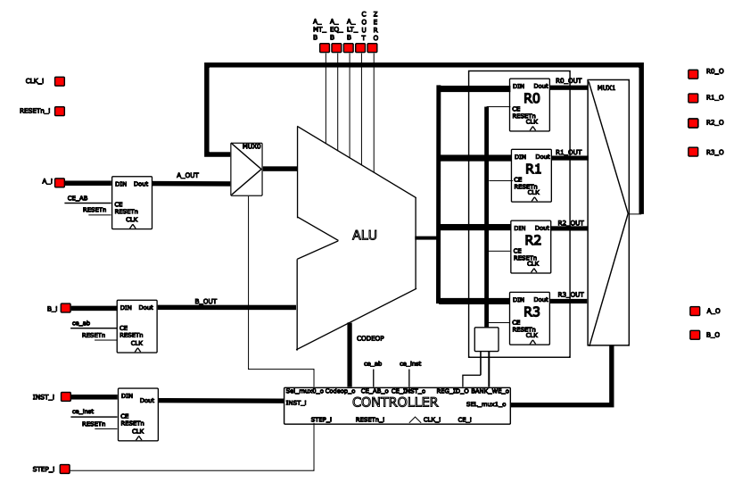

# 4-bits-Mirco-Computer
A micro-computer project that excute basic logic operations on unsigned 4 bits numbers implemented on FPGA Board (TERASIC DE10-LITE).

## Instruction (INST_i)

**It's an 8 bits number :**
| 7  6 | 5  4 | 3 | 2  1  0 |
| ----- | ----- | - | --------- |
| Desitnation Register |  Source Register | Entry | CODE-OP |

the Entry is a 1 bit number that indicates which values we will use in the op _(op = operation)_
|Entry (4th Bit) | 0 | 1 |
| - | - | - |
|Used Values | A_i op B_i | Ri op B_i |

Ri => is a value from one of the registers indicated in the 4th and 5th bit of the instruction (Section Registers for more details)

**Exemple :**

if Instruction is : **11 01 1 111**

The result will be saved in the register 4 and The entries will be R2 and B_i.

for the last 3 digits look at the next part.

## ALU (Arithmetic/Logic unit)

CODE_OP(Last 3 digits) represents the Arithmetic/Logic operation(op) between the two entry values.
| Code OP | Op |
| ---- | --------- |
| 000  |  A AND B  |
| 001  |  A NAND B |
| 010  |  A OR B   |
| 011  |  A NOR B  |
| 100  |  A XOR B  |
| 101  |  NOT A    |
| 110  |  A + B    |
| 111  |  A - B    |

A_MT_B_o => 1 if A > B, else 0

A_LT_B_o => 1 if A < B, else 0

A_EQ_B_o => 1 if A = B, else 0

ZERO_o => 1 if RES = 0, else 0

_N.B : RES = Result_

## Registers

| Register| Number |
| ------------- | ------------- |
| R1  |  00  |
| R2  |  01  |
| R3  |  10  |
| R4  |  11  |

## Controller

## Implementation on the FPGA Board
